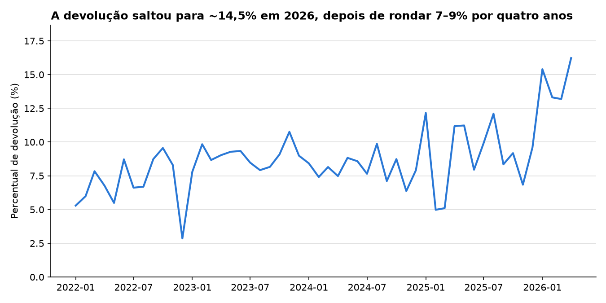
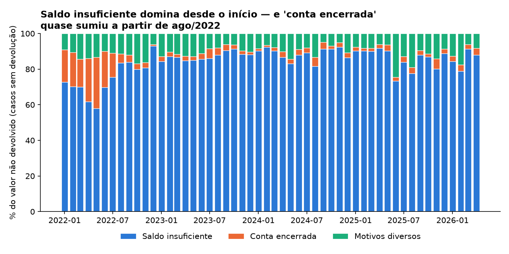
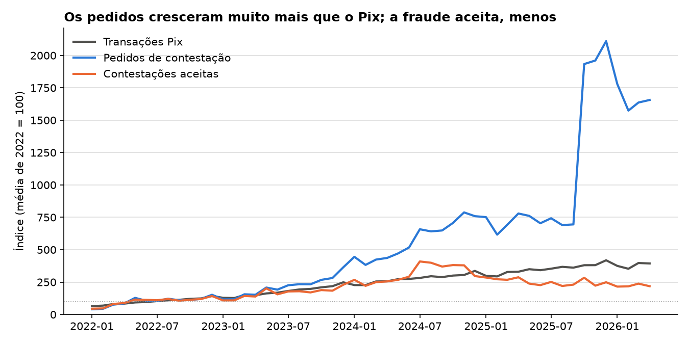

# MED em números

Quanto do dinheiro perdido em golpes do Pix volta para a vítima?

Este repositório acompanha os dados abertos do **MED — Mecanismo Especial de
Devolução**, o sistema do Banco Central que devolve valores a quem foi vítima de
fraude no Pix. Os dados são coletados direto da API do BCB, arquivados mês a mês
e analisados em notebooks reprodutíveis.

> **Projeto em construção, publicado passo a passo.**
> Cada etapa vira um commit assim que fica pronta, em vez de esperar o projeto
> inteiro. O histórico do repositório é parte do trabalho.

---

## A pergunta

Quando alguém cai num golpe e contesta a transferência, quanto do valor
efetivamente retorna — e, quando não retorna, por quê?

São três perguntas encadeadas:

1. Qual a proporção do valor contestado que é de fato devolvida?
2. Essa proporção mudou ao longo do tempo?
3. Entre os casos em que o dinheiro não volta, quais são os motivos e qual pesa
   mais?

---

## A resposta

Com os dados de jan/2022 a abr/2026:

1. **Cerca de 9%.** De R$ 24,5 bilhões em contestações aceitas como fraude,
   R$ 2,2 bilhões voltaram às vítimas pelo MED — e isso é um teto: a base não
   informa o valor dos pedidos rejeitados (73% deles, em quantidade), então
   sobre tudo o que foi contestado a proporção é menor.
2. **Ficou parada por quatro anos e subiu em 2026.** Entre 6% e 9% ao ano de
   2022 a 2025, e 14,5% em jan–abr/2026, quando entrou em vigor o MED 2.0, que
   permite recuperar dinheiro já transferido pra outras contas — coincidência
   no tempo clara, causa ainda não provada.
3. **Quando não volta, quase sempre é porque a conta já foi esvaziada:** saldo
   insuficiente responde por 86% do valor dos casos em que nada foi devolvido.





**Um canal que fica fora desses 9%:** a base registra outros R$ 3,1 bilhões
devolvidos por **bloqueio cautelar** — quando o banco de quem recebeu o Pix
retém a transferência suspeita por até 72 horas, por conta própria, e a
devolve à origem se confirma indício de fraude
([BB](https://blog.bb.com.br/bloqueio-cautelar-pix/)). Não entra na conta
porque não depende de a vítima contestar, e a base não diz se há sobreposição
com o MED.

---

## O que mais apareceu no caminho

- **O número absoluto engana.** De 2022 a 2025, o Pix cresceu 3,5×, os pedidos
  de contestação 10,4× e as contestações aceitas 2,5×. Por transação, os
  pedidos triplicaram, enquanto a fraude reconhecida pelas instituições caiu a
  partir de 2025. Como quem reconhece é a própria instituição contestada, a
  base não separa "menos fraude" de "crivo mais rígido".

  

- **Cada mudança de regra coincide com um indicador diferente.** O botão de
  contestação 100% digital (out/2025) com o salto no volume de pedidos e a
  queda da taxa de aceite pra ~10%; o MED 2.0 (nov/2025 a fev/2026) com a alta
  da devolução.
- **A taxa de aceite caiu de ~81% para ~10% em quatro anos** — continuamente,
  não só depois do botão digital.
- **A base fecha.** A fórmula oficial do percentual de devolução foi
  reconstruída (erro abaixo de 0,005 ponto percentual) e bateu com um número publicado na
  imprensa; e o valor aceito se decompõe exatamente em devolvido, resíduo dos
  casos parciais e casos sem devolução por motivo, nos 52 meses.

---

## Progresso

- [x] **0.** Repositório e pergunta
- [x] **1.** Coletor de dados da API
- [x] **2.** Primeiro contato com os dados
- [x] **3.** Validação da base
- [x] **4.** Primeiro gráfico
- [x] **5.** Volume de contestações
- [x] **6.** Contexto regulatório
- [x] **7.** Normalização pelo volume total de Pix
- [x] **8.** Decomposição dos motivos de não devolução
- [x] **9.** Comparação entre períodos
- [x] **10.** Padronização visual
- [ ] **11.** Escrita final
- [ ] **12.** Atualização automática mensal

Cada etapa tem seu notebook em [`notebooks/`](notebooks/), e o significado de
cada coluna da base está em [`DICIONARIO.md`](DICIONARIO.md).

---

## Os dados

**Fonte:** [Portal de Dados Abertos do Banco Central — Estatísticas do Pix](https://dadosabertos.bcb.gov.br/dataset/pix)
**Licença dos dados:** Open Data Commons ODbL
**Granularidade:** mensal, agregada para o Brasil inteiro

A tabela principal é `EstatisticasFraudesPix`, com 24 colunas cobrindo
contestações registradas, aceitas e rejeitadas, valores devolvidos integral e
parcialmente, motivos de não devolução e bloqueios cautelares.

A segunda é `EstatisticasTransacoesPix`, o total de transações Pix por mês —
o denominador que permite dizer se a fraude cresceu mais ou menos que o
próprio Pix. Ela exclui transferências entre contas da mesma instituição
(cerca de 11% das transações).

### Notas sobre a API

A API roda na plataforma Olinda, do BCB, e tem particularidades que custaram
tempo para descobrir. Ficam registradas aqui para quem for usar:

| Comportamento | Detalhe |
|---|---|
| As entidades exigem parâmetro | Chamar `EstatisticasFraudesPix` direto devolve `400 The URI is malformed`. A sintaxe correta é `Entidade(Param=@Param)?@Param='AAAAMM'` |
| O nome do parâmetro varia | `TransacoesPixPorMunicipio` usa `DataBase`, com B maiúsculo. As demais usam `Database` |
| O JSON vem embrulhado | A resposta vem entre `/*` e `*/`, o que quebra `json.loads` direto |
| O parâmetro não filtra o mês | `@Database='202301'` devolve todos os meses **a partir de** jan/2023, não só ele. Pra um mês só, é preciso acrescentar `$filter=AnoMes eq 202301`. A referência confiável é sempre o campo `AnoMes` de dentro da linha |
| `$apply` é ignorado | Agregação no servidor (`groupby`, `aggregate`) não funciona: a resposta vem crua. A tabela `EstatisticasTransacoesPix` tem centenas de MB — o coletor soma por mês localmente e grava só o total |
| As entidades com `_` não funcionam | `_EstatisticasFraudesPix` e similares aparecem no catálogo mas retornam 500 |
| A defasagem é maior que a documentada | A documentação indica publicação 30 dias após o fim do mês; na prática o atraso observado é de cerca de quatro meses |

---

## Estrutura

```
.
├── coletar.py                 # coleta da API, mês a mês, mesclando com o que já existe
├── teste_coletar.py           # testes do coletor
├── visual.py                  # padrão visual de todos os gráficos: grafico() e salvar()
├── teste_visual.py            # testes do padrão visual
├── DICIONARIO.md              # o que significa cada coluna, e o que ainda não se sabe
├── dados/
│   ├── fraude.csv             # consolidado, uma linha por mês
│   ├── fraude_cobertura.csv   # o que a última coleta encontrou em cada mês
│   ├── transacoes.csv         # total de transações Pix por mês
│   ├── transacoes_cobertura.csv
│   └── snapshots/             # retrato datado de cada coleta, nunca sobrescrito
├── notebooks/                 # análise, um notebook por etapa
└── graficos/                  # PNGs gerados pelos notebooks
```

Os **snapshots** existem de propósito. Estatística oficial é revisada, e guardar
o que a API respondeu em cada data permite detectar mudanças retroativas — algo
que só quem arquiva consegue fazer.

---

## Como reproduzir

Coletar os dados (não precisa instalar nada, só biblioteca padrão do Python 3.9+):

```bash
git clone https://github.com/ivadivad/med-em-numeros.git
cd med-em-numeros
python coletar.py fraude
python coletar.py transacoes   # demora: baixa centenas de MB, grava só o total mensal
```

Rodar de novo é seguro: o coletor mescla com o que já existe em `dados/`, e um
mês que falhar numa rodada não apaga o que já tinha sido coletado.

Rodar os testes:

```bash
python teste_coletar.py   # só biblioteca padrão
python teste_visual.py    # precisa de matplotlib (pip install -r requirements.txt)
```

Os notebooks leem os CSVs e o `visual.py` direto da URL bruta deste
repositório, então abrem e rodam no Colab sem precisar de upload. Fora do
repositório, os PNGs vão pra uma pasta `graficos/` criada ao lado do notebook.

---

## Limitações conhecidas

Estas ressalvas valem para qualquer conclusão tirada aqui:

- **A fraude é validada por quem está sendo contestado.** Quem julga a
  contestação é a própria instituição financeira envolvida, e mais da metade dos
  pedidos é descartada. "Fraude" nesta base significa fraude que a instituição
  reconheceu.
- **O denominador real é desconhecido.** Golpes não contestados, e vítimas que
  não registram ocorrência, não aparecem em lugar nenhum.
- **Não há recorte por instituição nem por município.** A tabela de fraude é
  agregada para o país inteiro, mês a mês. Não dá para comparar bancos.
- **A série começa em 2022.** Fraudes anteriores à criação do MED não estão
  representadas.
- **Antes e depois não é inferência causal.** Comparações entre períodos aqui
  descrevem o que mudou, não provam por que mudou.

---

## Licença

Código sob licença MIT. Os dados são públicos e pertencem ao Banco Central do
Brasil, sob Open Data Commons ODbL — a fonte deve ser citada em qualquer reuso.
